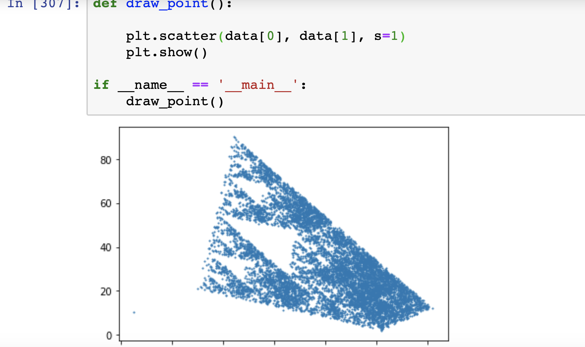
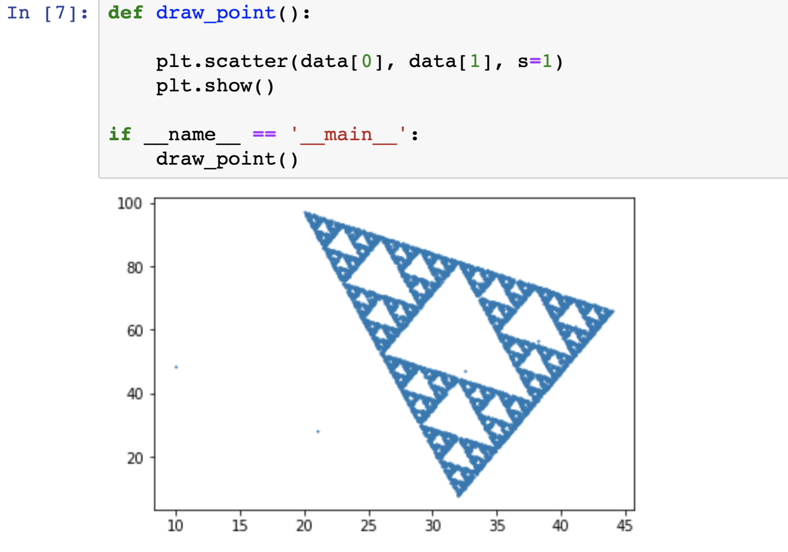

## Regularity In Random or Magic Highway of Triangles


Video [Triangles have a Magic Highway - Numberphile](https://www.youtube.com/watch?v=wVH4MS6v23U)

### This is the pyhon code, if you wnat to try/experiment

To run use
```
jupyter notebook
```

To install jupyter follow the [instruction]https://jupyter.readthedocs.io()




